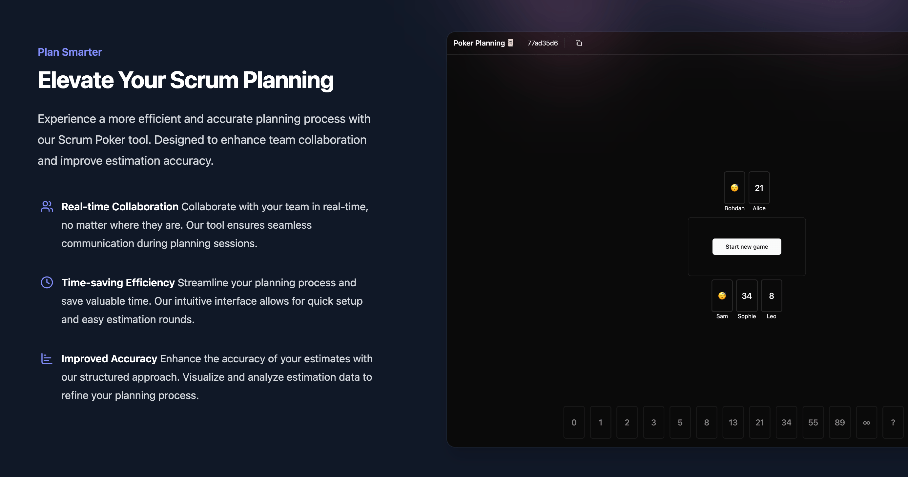

# PokerPlanning.org

PokerPlanning.org is an open-source, user-friendly online planning poker tool designed to enhance Scrum team collaboration and improve estimation accuracy. Our mission is to provide a free, accessible, and enjoyable planning poker experience for teams worldwide 🌍🌎🌏!



## Features 🚀

- Free to use
- Real-time collaboration
- Intuitive user interface
- Instant results visualization
- Customizable estimation scales (WIP)

## Technology Stack 🛠️

### Server-side

- Rust 🦀
- async-graphql 🚀

### Client-side

- TypeScript 🦺
- React ⚛️
- Apollo Client 📡
- shadcn/ui 😮‍💨

## Getting Started 🏁

### Prerequisites

- Git
- Rust
- Node.js and npm

### Setup

1. Clone the repository:

   ```sh
   git clone https://github.com/ModPhoenix/poker-planning.git
   cd poker-planning
   ```

2. Install cargo-watch (for development):
   ```sh
   cargo install cargo-watch
   ```

### Running the Server

1. Navigate to the server directory:

   ```sh
   cd server
   ```

2. Start the development server:
   ```sh
   cargo watch -x run
   ```

### Running the Web App

1. Navigate to the client directory:

   ```sh
   cd client
   ```

2. Copy the example environment file:

   ```sh
   cp .env.local.example .env.local
   ```

3. Install dependencies:

   ```sh
   npm install
   ```

4. Start the development server:

   ```sh
   npm run dev
   ```

## Running Tests 🧪

This project uses Vitest for unit and integration tests, and Playwright for end-to-end tests.

### Unit and Integration Tests

To run unit and integration tests:

```sh
npm t
```

### End-to-End Tests

To run end-to-end tests:

```sh
npm run test:e2e
```

To run end-to-end tests with UI:

```sh
npm run test:e2e:ui
```

## Deployment

This project can be deployed using DigitalOcean App Platform. Use the following commands with the DigitalOcean CLI:

```sh
doctl auth init
doctl apps create --spec spec.yaml
doctl apps list
doctl apps update APP-ID --spec=spec.yaml
```

## Contributing 🤝

We welcome contributions! Please feel free to submit a Pull Request.

## License 📜

This project is open source and available under the [MIT License](LICENSE).
